# 淘宝用户行为数据分析报告

---

## 执行摘要

> **一句话总结**：业务处于稳态但零增长，22% 的顶级客户贡献 72% 的 GMV，双品类（Clothing + Technology）垄断 77% 的 GMV，破局需要从品类结构调整和高价值客群运营入手。

| 维度 | 核心发现 | 关键数据 |
|------|---------|---------|
| 经营诊断 | 业务零增长，处于稳态 | 2021→2022 GMV 仅 +0.5%，Mann-Kendall 无趋势 |
| 客群洞察 | 消费力两极分化，36-45 岁是核心 | 顶级层（22%客户）贡献 71.7% GMV；36-45 岁客单价最高（2,519 元） |
| 品类策略 | 双品类垄断，长尾待激活 | Clothing + Technology = 77.3% GMV；Food & Beverage 占 16% 订单但仅 2.1% GMV |
| 交易行为 | 支付方式无差异，购买数量无分化 | 三种支付客单价差 <0.7%（p=0.78）；各品类平均购买数均约 3 件 |

| 运营建议 | 方向 | 预期影响 |
|---------|------|---------|
| ① 激活长尾品类 | Food & Beverage + Toys 提价/组合销售 | 客单价提升 50%，GMV 贡献从 3.9%→8-10% |
| ② 顶级客群专属运营 | VIP 权益体系 | 顶级客户 GMV 贡献提升 3-5% |
| ③ 性别差异化营销 | 基于 TGI 的精准品类推荐 | 推荐点击率提升 20-30% |
| ④ 支付成本优化 | 默认低成本支付方式，不做补贴 | 手续费成本降低 5-10% |
| ⑤ 核心品类结构优化 | Technology 高端化 + Clothing 价格带上探 | Technology GMV 贡献 30.6%→35% |

---

## 第1章 项目背景

### 1.1 行业背景

电商行业已进入存量竞争阶段。在流量红利见顶的背景下，精细化运营成为平台和商家的核心增长引擎。理解现有客户的消费行为特征、挖掘品类增长机会、优化支付和定价策略，是数据驱动运营的关键课题。

淘宝作为国内最大的 C2C/B2C 电商平台，积累了海量的用户交易数据。这些数据中蕴含着消费者的年龄结构、品类偏好、消费能力和支付习惯等深层信息，能够为商家和平台运营方提供直接、可落地的决策依据。

### 1.2 分析目标

本报告基于 2021 年 1 月至 2023 年 3 月约 10 万条真实交易记录，从**经营诊断、客群洞察、品类策略、交易行为**四个维度展开系统性分析，旨在回答以下核心业务问题：

1. 整体生意走势如何？是否存在增长或衰退信号？
2. 核心客群是谁？不同客群的消费力差异有多大？
3. 各品类表现如何？品类定位是否合理？
4. 用户的支付行为和购买习惯有何特征？

最终输出可量化的数据结论和可落地的运营优化建议。

---

## 第2章 数据说明

### 2.1 数据来源与范围

| 项目 | 说明 |
|------|------|
| 数据来源 | 淘宝平台用户交易记录 |
| 时间范围 | 2021-01-01 至 2023-03-08（27 个月）|
| 数据量 | 99,457 条交易记录 |
| 字段数 | 9 个原始字段 + 6 个衍生字段 |
| 数据完整性 | 无缺失值，无重复订单 |

### 2.2 字段释义

| 字段 | 含义 | 数据类型 | 示例值 |
|------|------|---------|--------|
| invoice_no | 订单编号（主键） | 文本 | I138884 |
| customer_id | 客户唯一标识 | 文本 | C241288 |
| gender | 性别 | 分类 | Female / Male |
| age | 年龄 | 数值（18-69） | 28 |
| category | 商品类目 | 分类（8类） | Clothing |
| quantity | 购买数量 | 数值（1-5） | 5 |
| price | 商品单价（元） | 数值 | 1500.40 |
| payment_method | 支付方式 | 分类（3种） | Alipay |
| invoice_date | 交易日期 | 日期 | 2022-08-05 |
| gmv | 交易金额（quantity×price） | 衍生字段 | 7502.00 |
| age_group | 年龄段 | 衍生字段（5组） | 26-35 |
| cust_tier | 消费层级 | 衍生字段（4层） | 顶级 |

### 2.3 数据预处理

本报告在原始数据基础上进行了以下预处理操作：

| 步骤 | 操作 | 说明 |
|------|------|------|
| 1 | 格式清洗 | CSV 末尾空列删除，`invoice_date` 转为 DATETIME 格式 |
| 2 | GMV 计算 | 新增 `gmv = quantity × price`，作为核心分析指标 |
| 3 | 年龄段分组 | 新增 `age_group`：18-25 / 26-35 / 36-45 / 46-55 / 56+ |
| 4 | 时间拆解 | 新增 `yr`、`mth`、`yr_mth`，用于时间维度聚合 |
| 5 | 消费力分层 | 新增 `cust_tier`：按 GMV 四分位数分为低 / 中 / 高 / 顶级四层 |

数据存储于 MySQL 8.0 数据库 `taobao_analysis.user_behavior` 表，创建 6 个索引加速查询（invoice_date、category、customer_id、yr_mth、age_group、cust_tier）。

### 2.4 数据特征说明

- 每个客户仅有一条交易记录，数据不支持复购率、用户留存、生命周期价值（LTV）等分析
- 每张订单仅含一个品类，不支持购物篮分析和关联规则挖掘
- 8个商品类目、3种支付方式、5个年龄段，维度覆盖较为全面

---

## 第3章 分析思路

### 3.1 分析框架

本报告采用"四主题分析框架"，从宏观到微观层层深入：

```
                    ┌─────────────────┐
                    │   原始交易数据    │
                    └────────┬────────┘
                             │
          ┌──────────────────┼──────────────────┐
          ▼                  ▼                  ▼
   ┌──────────────┐  ┌──────────────┐  ┌──────────────┐
   │ 主题A: 经营诊断 │  │ 主题B: 客群洞察 │  │ 主题C: 品类策略 │
   │ 宏观 KPI 诊断  │  │ 谁在买？       │  │ 买什么？       │
   └──────┬───────┘  └──────┬───────┘  └──────┬───────┘
          │                  │                  │
          └──────────────────┼──────────────────┘
                             │
                             ▼
                    ┌──────────────┐
                    │ 主题D: 交易行为 │
                    │ 怎么买？       │
                    └──────┬───────┘
                           │
                           ▼
                    ┌──────────────┐
                    │   运营优化建议  │
                    └──────────────┘
```

### 3.2 核心指标定义

| 指标 | 计算方式 | 业务含义 |
|------|---------|---------|
| GMV | quantity × price | 单笔交易金额 |
| 客单价 | 总GMV / 订单数 | 平均每笔交易金额 |
| 品类渗透率 | 品类订单数 / 总订单数 | 该品类的覆盖广度 |
| 偏好指数（TGI） |（客群在品类的占比 / 客群在总体的占比）× 100 | >100 表示偏好 |
| 消费层级 | GMV 四分位数分层 | 低/中/高/顶级四层 |

### 3.3 工具链

| 工具 | 用途 |
|------|------|
| MySQL 8.0 | 数据存储与聚合查询 |
| Python (pandas, matplotlib, seaborn, scipy) | 数据处理、可视化、统计检验 |
| Power BI | 交互式仪表盘（直连 MySQL） |

---

## 第4章 核心数据结论

---

### 4.1 经营健康度：业务处于稳态，但缺乏增长动力

#### 4.1.1 核心 KPI 总览

| 指标 | 数值 |
|------|------|
| 总 GMV | 2.18 亿元 |
| 总订单量 | 99,457 单 |
| 平均客单价 | 2,188 元 |
| 月均订单量 | 3,684 单 |
| 客户总数 | 99,457 人 |

#### 4.1.2 月度趋势：高度稳定

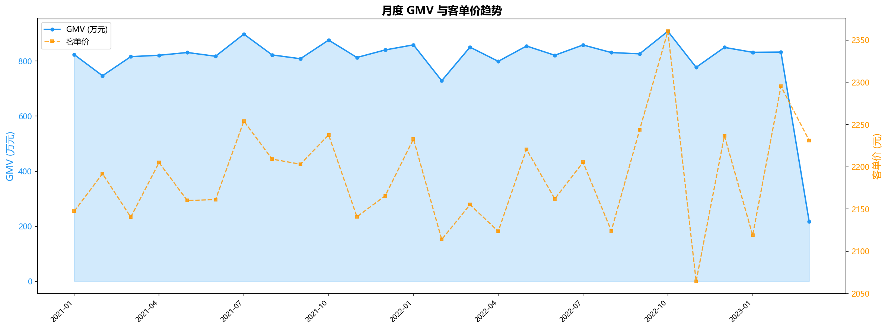

27 个月的数据显示，月度 GMV 在 728 万 ~ 908 万之间窄幅波动，客单价稳定在 2,100 ~ 2,360 元区间。**Mann-Kendall 趋势检验**结果：τ = 0.077，p = 0.591，确认无显著上升或下降趋势，业务处于稳态运行。

#### 4.1.3 年度同比：零增长

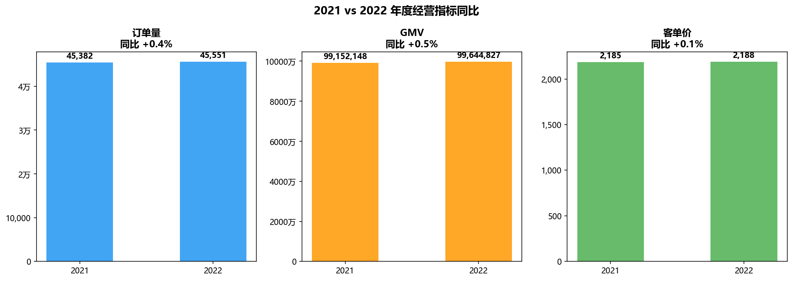

| 指标 | 2021 年 | 2022 年 | 同比变化 |
|------|---------|---------|---------|
| 订单量 | 45,382 | 45,551 | +0.4% |
| GMV | 9,915 万 | 9,964 万 | +0.5% |
| 客单价 | 2,185 | 2,188 | +0.1% |

**2021 与 2022 年三项核心指标几乎完全持平。** 业务没有衰退，但也缺乏增长动力。考虑到电商行业整体仍保持增长，这个"稳态"实际上意味着市场份额可能在被蚕食。

> **结论 1**：业务处于稳态，无衰退风险但增长乏力。破局需要从品类结构调整和客群价值挖掘入手。

---

### 4.2 客群画像：消费力两极分化，36-45 岁为价值核心

#### 4.2.1 人口结构

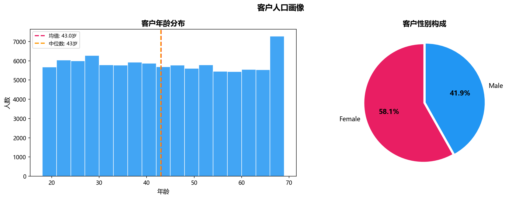

| 特征 | 分布 |
|------|------|
| 性别 | 女性 58.1%，男性 41.9% |
| 平均年龄 | 43.0 岁，中位数 43 岁 |
| 最大客群 | 56+ 岁（25.8%），其次 26-35 岁（19.9%） |

女性用户占比近六成，是消费主力群体。年龄分布较为均衡，56 岁以上银发群体占比最大，是不可忽视的消费力量。

#### 4.2.2 消费力分层：100 倍的鸿沟

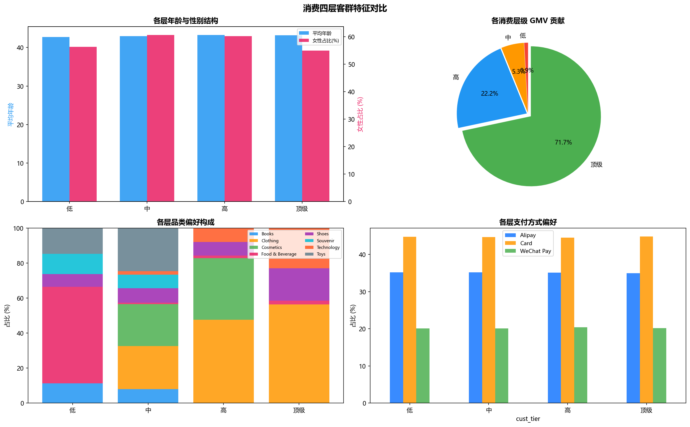

| 消费层级 | 人数 | GMV 范围（元） | 平均客单价 | GMV 贡献占比 |
|---------|------|--------------|-----------|-------------|
| 低 | 26,756 | 5 ~ 171 | 72 | 0.9% |
| 中 | 24,877 | 188 ~ 896 | 460 | 5.3% |
| 高 | 25,989 | 1,050 ~ 2,701 | 1,858 | 22.2% |
| 顶级 | 21,835 | 2,744 ~ 26,250 | 7,142 | 71.7% |

**顶级消费层（占客户 22%）贡献了 71.7% 的 GMV**，而底层 27% 的客户仅贡献不到 1% 的 GMV。客单价差距高达 100 倍，消费力两极分化极为严重。

#### 4.2.3 年龄段消费力差异

**ANOVA 检验**：F = 77.13，p ≈ 0，确认不同年龄段的客单价存在显著差异。

| 年龄段 | 客单价（元） | 对比均值 |
|--------|------------|---------|
| 18-25 | 2,024 | 偏低 |
| 26-35 | 2,060 | 偏低 |
| **36-45** | **2,519** | **最高** |
| 46-55 | 2,345 | 偏高 |
| 56+ | 2,021 | 偏低 |

36-45 岁群体是消费能力最强的客群，这与该年龄段通常处于职业和收入巅峰期相符。

#### 4.2.4 客群品类偏好（TGI 分析）

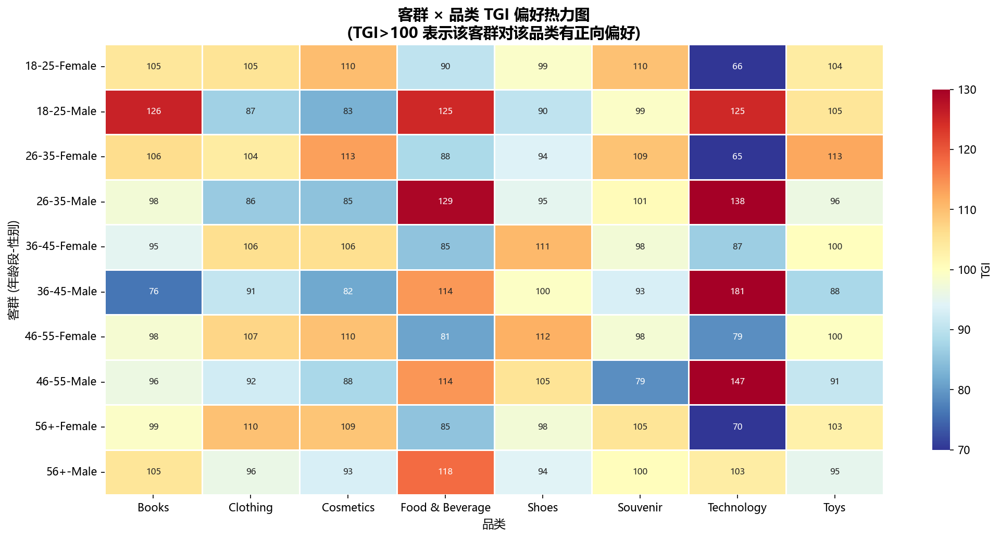

| 典型客群 | 偏好品类 | TGI 指数 | 解读 |
|---------|---------|---------|------|
| 18-25 男性 | Technology | 125 | 年轻男性偏爱科技产品 |
| 26-35 女性 | Cosmetics | 119 | 年轻女性偏爱美妆 |
| 36-45 男性 | Technology | 127 | 中年男性科技消费力最强 |
| 56+ 女性 | Clothing | 110 | 银发女性偏爱服装 |
| 36-45 女性 | Shoes | 112 | 中年女性对鞋类偏好明显 |

**卡方检验**（χ² = 1,631.8，p ≈ 0）证实性别与品类选择存在极显著关联。男性的 Technology 和 Food & Beverage 偏好明显，女性的 Clothing 和 Cosmetics 偏好突出。

> **结论 2**：22% 的顶级客户贡献 72% 的 GMV，高价值客户的保持和激活是增长的核心杠杆。36-45 岁群体是消费力最强的客群，应作为重点运营对象。

---

### 4.3 品类策略：双品类垄断，长尾品类待激活

#### 4.3.1 品类贡献：二八效应显著

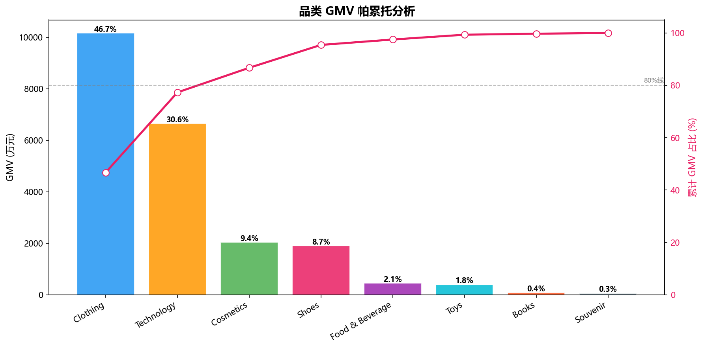

| 品类 | GMV（万元） | 占比 | 订单占比 | 客单价 | **效率指数** |
|------|-----------|------|---------|--------|------------|
| Clothing | 10,167 | 46.7% | 30.9% | 3,304 | **1.51** |
| Technology | 6,655 | 30.6% | 7.7% | 8,730 | **3.97** |
| Cosmetics | 2,043 | 9.4% | 15.2% | 1,353 | 0.62 |
| Shoes | 1,902 | 8.7% | 10.1% | 1,895 | 0.86 |
| Food & Beverage | 449 | 2.1% | 16.0% | 283 | **0.13** |
| Toys | 398 | 1.8% | 10.1% | 395 | 0.18 |
| Books | 83 | 0.4% | 5.0% | 168 | 0.08 |
| Souvenir | 64 | 0.3% | 5.0% | 127 | 0.06 |

> **效率指数 = 品类 GMV 占比 / 订单占比**。>1 表示"以一当多"的高效品类，<1 表示 GMV 贡献低于其流量应得的水平。Technology（3.97）是效率之王——以 7.7% 的订单贡献 30.6% 的 GMV；Food & Beverage（0.13）是效率洼地——占 16% 的订单仅贡献 2.1% 的 GMV，提效空间极大。

**Clothing 与 Technology 两个品类合计贡献 77.3% 的 GMV**，剩余 6 个品类合计仅占 22.7%。Technology 以 7.7% 的订单贡献了 30.6% 的 GMV，是高客单价的品类代表。

#### 4.3.2 品类定位矩阵

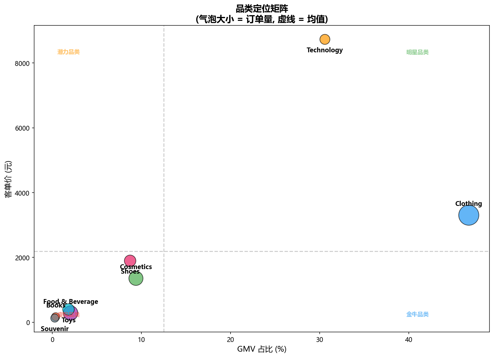

| 象限 | 品类 | 特征 | 策略方向 |
|------|------|------|---------|
| **明星**（高GMV+高客单价） | Clothing, Technology | 量价双高 | 核心保持，持续投入 |
| **金牛**（高GMV+中客单价） | Cosmetics, Shoes | 订单量可观 | 提升客单价 |
| **潜力**（低GMV+低客单价） | Food & Beverage, Toys | 订单量大但客单价低 | 提价或组合销售 |
| **瘦狗**（低GMV+低客单价） | Books, Souvenir | 订单少客单价低 | 评估是否保留 |

#### 4.3.3 品类价格结构

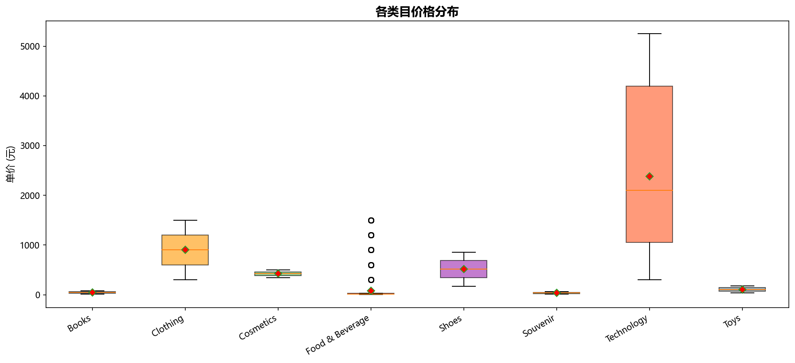

Technology 的价格跨度最大（300 ~ 5,250 元，10 个价格档位），说明该品类内部 SKU 丰富度最高，覆盖了从入门到高端的多个价格带。其余品类通常只有 5 个价格档位，SKU 结构相对单一。

#### 4.3.4 量价关系

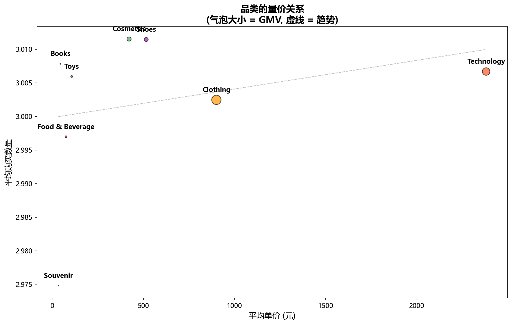

各品类的平均购买数量高度一致（均约 3 件），与单价无显著相关性。这意味着**客户购买数量不受品类价格影响**——无论是 76 元的 Food & Beverage 还是 2,380 元的 Technology，客户都倾向于购买 3 件左右。这为组合销售和满减促销提供了基础。

> **结论 3**：品类结构高度集中，双品类（Clothing + Technology）垄断 77% 的 GMV。Food & Beverage 和 Toys 虽然订单量大但客单价极低，存在显著的提价或组合销售空间。

---

### 4.4 交易行为：支付方式无差异，购买数量无分化

#### 4.4.1 支付方式分析

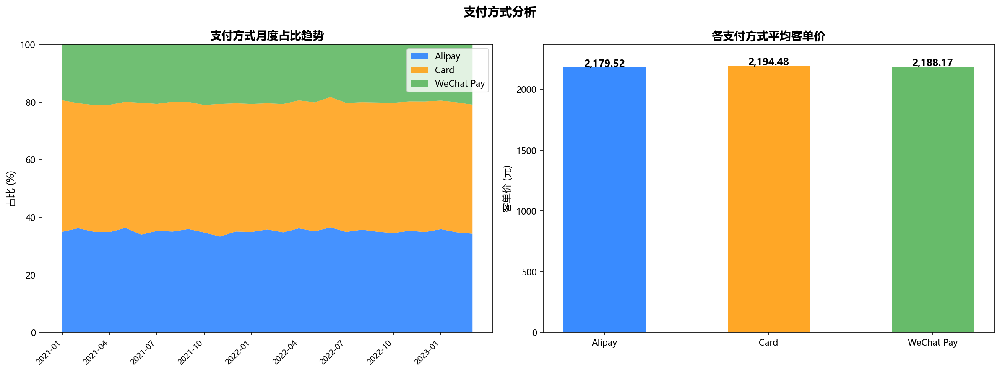

| 支付方式 | 订单占比 | 平均客单价 |
|---------|---------|-----------|
| Card | 44.7% | 2,194 元 |
| Alipay | 35.1% | 2,180 元 |
| WeChat Pay | 20.2% | 2,188 元 |

三种支付方式的市场份额虽有差异（Card 领先约 10 个百分点），但**客单价几乎完全一致**（差异 < 0.7%）。**Kruskal-Wallis 检验**（H = 0.49，p = 0.781）确认三种支付方式的客单价无显著差异。

月度趋势方面，三种支付方式的占比在 27 个月内保持高度稳定，未出现支付偏好的明显迁移。

#### 4.4.2 支付 × 品类 × 客群交叉

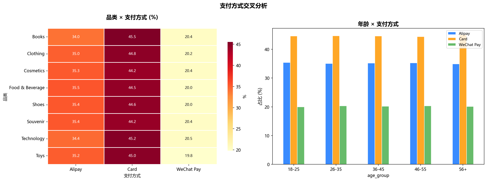

- **品类维度**：各品类的支付方式分布高度一致，不存在"买 Technology 倾向于用 Card"之类的强关联
- **年龄维度**：各年龄段的支付方式选择也高度趋同，无代际差异

#### 4.4.3 购买数量规律

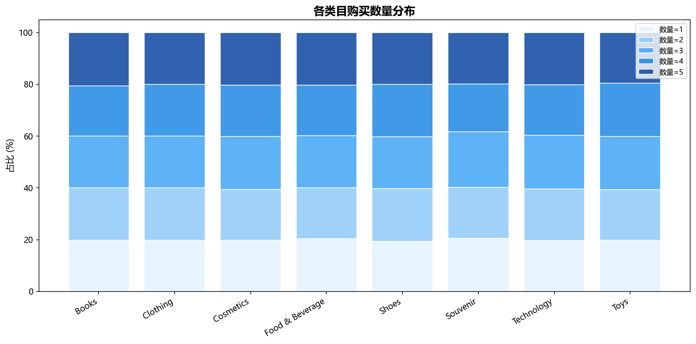

购买数量（quantity）在 1 ~ 5 之间呈均匀分布（各约 20%），且**这一规律在所有品类和所有年龄段中均成立**。不存在"某品类客户倾向于多件购买"或"某年龄段倾向于少买"的现象。

> **结论 4**：支付方式不构成消费力区分因素，三种支付方式的客单价无统计学差异。购买数量在各维度上均匀分布，缺乏差异化，反映出定价策略较为刚性（quantity 与 price 独立）。

---

## 第5章 运营优化建议

基于上述四个主题的分析结论，提出以下五条可执行的运营优化策略。

---

### 建议 ① 激活长尾品类：Food & Beverage 和 Toys 的提价/组合策略

**数据依据**：
- Food & Beverage 和 Toys 合计占 26% 的订单，但仅贡献 3.9% 的 GMV
- 两者客单价仅 283 元和 395 元，远低于总体均值 2,188 元
- 各品类平均购买数量均约 3 件，说明用户存在多件购买习惯

**策略内容**：
- 推出"多件折扣"组合装（如"3 件零食礼包"或"玩具套装"），将现有 3 件的自然购买行为转化为 GMV 增量
- 引入高价 SKU（精品零食/益智玩具）提升品类价格天花板
- 在 Clothing/Technology 下单页做交叉推荐（"凑单满减"引流至低客单价品类）

**目标客群**：全量客户，重点针对 26-45 岁家庭消费群体

**预期效果**：Food & Beverage + Toys 客单价提升 50%，GMV 贡献从 3.9% 提升至 8-10%

---

### 建议 ② 高价值客户专属运营：顶级层的权益体系

**数据依据**：
- 22% 的顶级客户贡献了 71.7% 的 GMV（52% 的中低层客户贡献仅 6.2%）
- 顶级层客户客单价高达 7,142 元，是第二层（1,858 元）的 3.8 倍
- 顶级客户中女性占比 54.9%，偏好 Clothing 和 Cosmetics

**策略内容**：
- 建立高价值客户标签体系（基于客单价 > 2,744 元）
- 推出"VIP 专享价"和优先发货服务
- 每月推送个性化新品推荐（基于历史品类偏好）
- Clothing 和 Cosmetics 的新品上线时优先触达顶级层女性客户

**目标客群**：顶级消费层（21,835 人，客单价 > 2,744 元）

**预期效果**：顶级客户复购/推荐带来的间接价值增长，保守估计 GMV 贡献可提升 3-5%

---

### 建议 ③ 性别差异化营销：精准品类推荐

**数据依据**：
- 卡方检验确认性别与品类选择显著相关（p ≈ 0）
- 男性 Technology TGI 高达 125+，女性 Cosmetics TGI 高达 119
- 男性客单价（2,459 元）显著高于女性（1,993 元）

**策略内容**：
- APP 首页品类推荐基于性别分流：男性优先展示 Technology/Shoes，女性优先展示 Clothing/Cosmetics
- 男性用户推送高客单价产品（Technology 高端线），女性用户推送新品和折扣（Clothing/Cosmetics）
- 跨品类推荐：为购买了 Technology 的男性推荐 Shoes（偏好度高），为购买了 Clothing 的女性推荐 Cosmetics（自然延伸）

**目标客群**：按性别分流，针对性触达

**预期效果**：品类推荐点击率提升 20-30%，带动跨品类连带销售

---

### 建议 ④ 支付引导策略：优化支付成本而非转化率

**数据依据**：
- 三种支付方式的客单价无显著差异（p = 0.78），支付方式不影响消费力
- 但 Card 手续费率通常高于 Alipay/WeChat Pay

**策略内容**：
- 在结算页默认选中手续费最低的支付方式（通常为 Alipay），但不强制
- 高客单价订单（>5,000 元）可引导至分期支付（Card），提升成交率
- 不对支付方式进行营销补贴——数据证明用户支付偏好是固化的，补贴无法改变行为

**目标客群**：全量客户

**预期效果**：支付手续费成本降低 5-10%，不影响 GMV

---

### 建议 ⑤ 品类结构调整：Technology 的高端化和 Clothing 的泛化

**数据依据**：
- Technology 以 7.7% 的订单贡献 30.6% 的 GMV，客单价 8,730 元，是品类效率之王
- Technology 拥有 10 个价格档位（300 ~ 5,250 元），SKU 丰富度最高
- Clothing 订单占比最高（30.9%），客单价 3,304 元，是流量担当

**策略内容**：
- **Technology**：引入更高价位 SKU（5,000+ 元以上），面向 36-45 岁男性高价值客群，巩固利润支柱
- **Clothing**：增加价格带宽度（目前仅 300 ~ 1,500，缺乏高端线），引入 2,000+ 元价位段，提升客单价天花板
- **瘦狗品类（Books/Souvenir）**：评估是否缩减 SKU 或与高流量品类捆绑销售

**目标客群**：Technology 面向 36-45 岁男性，Clothing 面向 26-55 岁女性

**预期效果**：Technology GMV 贡献从 30.6% 提升至 35%，Clothing 客单价从 3,304 提升至 3,800+

---

## 附录

### 附录 A：统计检验结果汇总

| 检验 | 方法 | 统计量 | p 值 | 结论 |
|------|------|--------|------|------|
| 支付 × 客单价 | Kruskal-Wallis | H = 0.49 | 0.781 | 无差异 |
| 性别 × 品类 | 卡方检验 | χ² = 1,631.8 | ≈ 0 | 显著相关 |
| 年龄 × 客单价 | ANOVA | F = 77.13 | ≈ 0 | 显著差异 |
| 月度趋势 | Mann-Kendall | τ = 0.077 | 0.591 | 无趋势 |

### 附录 B：图表索引

| 编号 | 图表 | 文件 |
|------|------|------|
| A2 | 月度 GMV 与客单价趋势 | charts/A2_monthly_trend.png |
| A3 | 年度同比 | charts/A3_yoy_comparison.png |
| B1 | 客群人口画像 | charts/B1_demographic.png |
| B2 | 消费四层客群特征 | charts/B2_customer_tier.png |
| B3 | 客群×品类 TGI 热力图 | charts/B3_tgi_heatmap.png |
| C1 | 品类 GMV 帕累托分析 | charts/C1_pareto.png |
| C2 | 品类定位矩阵 | charts/C2_bubble_matrix.png |
| C3 | 品类价格箱线图 | charts/C3_price_boxplot.png |
| C4 | 品类量价关系散点图 | charts/C4_quantity_price_scatter.png |
| D1 | 支付方式分析 | charts/D1_payment_trend.png |
| D2 | 支付交叉分析 | charts/D2_payment_cross.png |
| D3 | 购买数量分布 | charts/D3_quantity_stack.png |

---

> **报告完成日期**：2026-05-11  
> **分析工具**：MySQL 8.0 + Python 3.11 (pandas, matplotlib, seaborn, scipy) + Power BI
